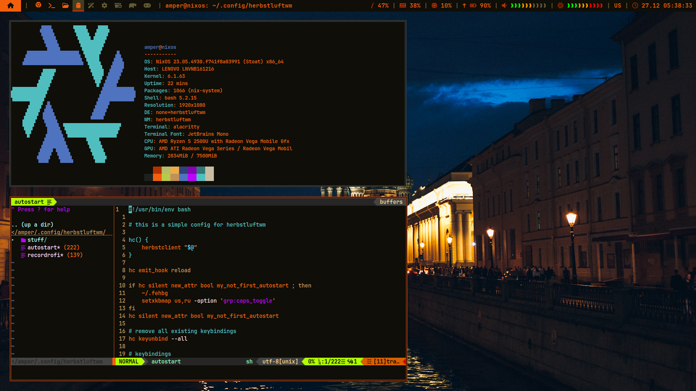

# herbstluftwm petrogradnoch rice

My herbstluftwm configuration files + polybar, nvim and alacritty.



## Installation

Don't worry, this script will create reserve copy of your old configuration files for alacritty, herbstluftwm, nvim and polybar!
```bash
./install.sh
```

